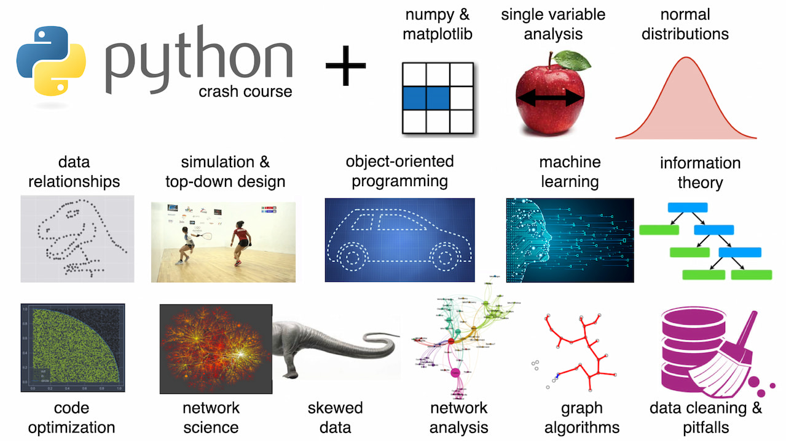
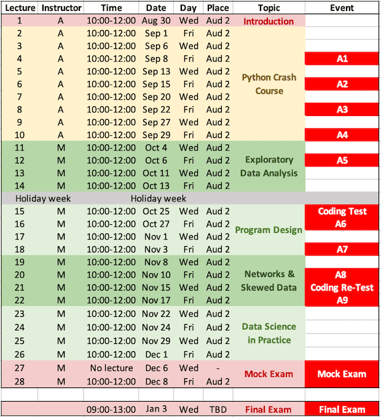

# Course materials for: Introduction to Data Science and Programming
These course materials cover the course held in 2023, at IT University of Copenhagen, after several iterations of improvements. The materials cover 25 units, each containing a 2-hour lecture plus 2-hour exercise, and additional course materials. Public course page: [https://learnit.itu.dk/local/coursebase/view.php?ciid=1218](https://learnit.itu.dk/local/coursebase/view.php?ciid=1218)

**Prerequisites**: Secondary school math. [Installed Python environment](files/installations.pdf). No programming skills required.   
**Ideal level/program**: 1st year Bachelor in Data Science  

## Topics

The course is split into two parts:

### I. Python Crash Course (9 units)

· 2. Operators and data types · 3. Lists and sets · 4. Control flow and conditional statements · 5. Functions and  dictionaries · 6. Strings, text files, and IO · 7. Comprehensions, shell and scripting · 8. Recursion, file formats, and pandas · 9. Binary search and conda · 10. Web scraping ·

### II. Data Science & Program Design (15 units)

· 11. Array programming with numpy · 12. Single variable analysis · 13. Normal distributions · 14. Data relationships · 15. Simulation and top-down design · 16. Object-oriented programming · 17. Code optimization · 18. Induction and command line tools · 19.  Network science· 20. Skewed data · 21. Network analysis and visualization · 22. Graph algorithms · 23. Machine learning · 24. Information theory · 25. Data cleaning and pitfalls ·

## Schedule

## Folder structure and learning activities
[admin/](/admin): Auxiliary files for the course manager used to create materials, manage the course, or to set up the course page. Not shared with students.

[docs/](/docs): Files related to this github repo.

[exam/](/exam): Materials for creating a written pen&paper exam using the [exam LaTeX package](https://ctan.org/pkg/exam). An example mock exam is provided.

[files/](/files): General course files to be shared with students during the course.

[mandatory/](/mandatory): Materials for mandatory activities: coding test and home assignments. Not shared publicly.

`unit[XX]_[name]/`, where `[XX]` is `01`,..,`25`:  The 25 shared units. All files are shared with students, including contents of `files` and `reading` subfolders in advance, except for `.key` files which are used by the instructor to create the `.pdf` slides. A few units do not have an exercise. An additional unit 26 is a personalized lecture drawing from the instructor's own research and is not provided here. Additional units 27 and 28 have no materials as they are reserved for taking and discussing a mock exam, respectively.

## Sources
The course materials were adapted from a number of sources. All materials were used for educational, non-commercial reasons only. Feel free to use as you wish for the same purpose, at your own risk. For other re-use questions please consult the license of the respective source:

* Scientific Python course by Roberta Sinatra
* A lecture of J.R. Johansson (http://jrjohansson.github.io)
* Python for Data Analysis by Wes McKinney
* Introduction to the practice of statistics by D.S. Moore and G.R. McCabe
* Python Programming by John Zelle
* https://www.thedigitalcatonline.com/blog/2015/03/14/python-3-oop-notebooks/
* https://github.com/UofTCoders/studyGroup/tree/gh-pages/lessons/python/classes
* https://www.thedigitalcatonline.com/blog/2015/03/14/python-3-oop-notebooks/
* https://towardsdatascience.com/speed-up-jupyter-notebooks-20716cbe2025
* https://jakevdp.github.io/PythonDataScienceHandbook/01.07-timing-and-profiling.html
* https://people.duke.edu/~ccc14/sta-663/MakingCodeFast.html
* Network Science by A.L. Barabasi
* Networks: An Introduction by M.E.J. Newman
* Bruno Gonçalves / Data4Sci: https://github.com/DataForScience/Networks
* James Bagrow: http://bagrow.com/dsv/
* A network science class by Sean Cornelius and Emma Thompson

## Credits
Python Crash Course: Anastassia Vybornova  
Main course organization, and Data Science & Program Design lectures: [Michael Szell](http://michael.szell.net)  
Data Science & Program Design exercises: Caroline Bjerre Benn Jørgensen, Jonas-Mika Senghaas  
