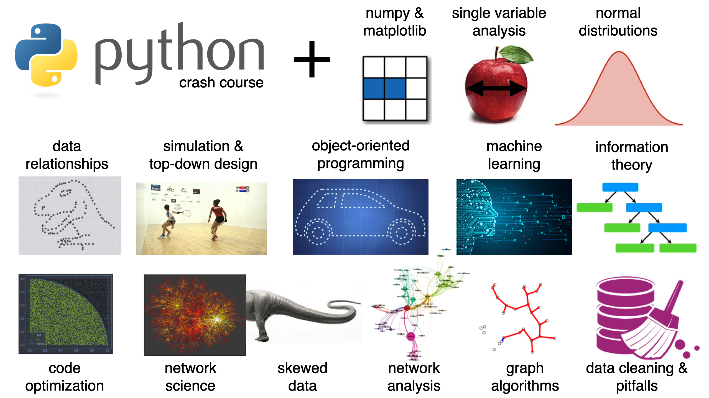

# Course materials for: Introduction to Data Science and Programming
These course materials cover the second half of the course held in fall 2019 at IT University of Copenhagen. Public course page: https://learnit.itu.dk/local/coursebase/view.php?ciid=282

## Topics

The covered topics are:

* Scientific programming with numpy 
* Single variable analysis
* Normal distributions
* Data relationships
* Simulation and top-down design
* Object-oriented programming
* Code optimization
* Introduction to network science
* Skewed data
* Graph properties
* Network models
* Network analysis and visualization
* Graph algorithms

These topics come after the first half of the course (not included here) which covers introduction to programming in Python.

## Source
The course materials were adapted from a number of sources. All materials were used for educational, non-commercial reasons only. Feel free to use as you wish for the same purpose, at your own risk. For other re-use questions please consult the license of the respective source:

* Scientific Python course by Roberta Sinatra
* A lecture of J.R. Johansson (http://jrjohansson.github.io)
* Python for Data Analysis by Wes McKinney
* Introduction to the practice of statistics by D.S. Moore and G.R. McCabe
* Python Programming by John Zelle
* https://www.thedigitalcatonline.com/blog/2015/03/14/python-3-oop-notebooks/
* https://github.com/UofTCoders/studyGroup/tree/gh-pages/lessons/python/classes
* https://www.thedigitalcatonline.com/blog/2015/03/14/python-3-oop-notebooks/
* https://towardsdatascience.com/speed-up-jupyter-notebooks-20716cbe2025
* https://jakevdp.github.io/PythonDataScienceHandbook/01.07-timing-and-profiling.html
* https://people.duke.edu/~ccc14/sta-663/MakingCodeFast.html
* Network Science by A.L. Barabasi
* Networks: An Introduction by M.E.J. Newman
* Bruno Gonçalves / Data4Sci: https://github.com/DataForScience/Networks
* James Bagrow: http://bagrow.com/dsv/
* A network science class by Sean Cornelius and Emma Thompson